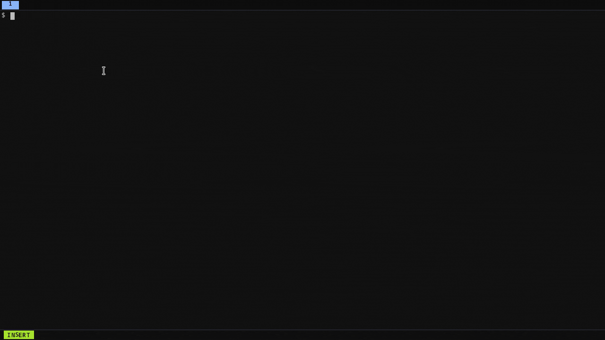

# pitlist

<p align="center">
  
</p>

A personal CLI/TUI for daily task planning and activity tracking. Plain YAML files, git-versioned, no database.

```
pitlist add "Write RFC" --context work --label auth --priority high
pitlist log "Deep dive into token bug" --tag debugging --duration 45
pitlist                  # open TUI
```

---



---

## Install

```bash
git clone https://github.com/roramirez/pitlist
cd pitlist
make install
```

Requires Go 1.19+.

---

## How it works

Two separate concerns:

**Tasks** — what you plan to do, organized by day.
**Activity log** — what you actually did, optionally linked to a task.

Data lives in `~/pitlist/` as plain YAML files (one per day). Every write auto-commits to a local git repo inside that directory.

---

## TUI

Launch with `pitlist` (no subcommand). Four tabs:

| Tab | Key | Purpose |
|---|---|---|
| Tasks | `1` | Plan tasks for a day, grouped by context |
| Activity | `2` | Log what you did |
| Agenda | `3` | Pending tasks across ±7 days |
| Search | `4` | Full-text and `#tag` search across all history |

### Tasks view

```
← Mon May 19 →
──────────────────────────────
  work  ────────────────────
  [ ] Write RFC for auth  [auth] !
  [~] Review PR #234  [review]

  personal  ──────────────────
  [ ] Dentist appointment

  ── carried ──
  [ ] Fix login timeout  ↑
```

| Key | Action |
|---|---|
| `h` / `l` | Previous / next day |
| `j` / `k` | Move cursor |
| `tab` | Switch to detail pane |
| `a` | Add task |
| `e` | Edit task (title, context, labels, priority) |
| `d` | Toggle done |
| `c` | Carry to another day (prompts for date) |
| `n` | Edit notes |
| `L` | Log activity linked to this task |
| `D` | Delete task |
| `/` | Filter (searches all days) |
| `w` | Toggle week view |

### Task detail pane

Shows status, priority, context, labels, notes, and all linked activity entries with total time:

```
Write RFC for auth
──────────────────
Context:  work
Status:   todo
Priority: high
Labels:   auth

Activity:  ∑ 1h 15m
  May 18 14:30  45m  Deep dive into token bug  [debugging]
  May 19 09:00  30m  Drafted token rotation section  [auth]

n notes  L log activity  d done  c carry
```

### Activity Log view

```
← Activity Log  Mon May 19 →

  09:00  30m  Drafted token rotation section  [auth]  → t-20260519-001
  11:00  60m  1:1 with manager  [meetings]

  Total logged: 1h 30m
```

| Key | Action |
|---|---|
| `h` / `l` | Previous / next day |
| `j` / `k` | Move cursor |
| `a` | Add entry |
| `D` | Delete entry |

When adding an activity, duration auto-calculates the start time (`now - minutes`). The Date field shows the computed timestamp and is editable.

### Agenda view

Shows all pending tasks in a ±7 day window. Days without pending tasks are hidden. Past-due tasks show `overdue`.

| Key | Action |
|---|---|
| `j` / `k` | Navigate |
| `d` | Mark done |
| `enter` | Jump to that day in Tasks |
| `r` | Refresh |

### Search view (`4`)

Type to search. Results update in real time.

- `auth` — matches tasks with label `auth` + activities with tag `auth` + any text containing "auth"
- `#auth` — strict tag/label search only
- `token refresh` — multi-word text search

**Input mode** (default when entering Search):

| Key | Action |
|---|---|
| `↓` / `enter` | Switch to navigate mode |
| `esc` | Stop typing, switch to navigate mode |
| `q` | Quit |
| `1`–`4` | Switch tab |

**Navigate mode:**

| Key | Action |
|---|---|
| `j` / `k` | Move cursor |
| `enter` | Jump to result's day |
| `i` / `esc` / `/` | Back to input |
| `q` | Quit |
| `1`–`4` | Switch tab |

---

## CLI

### Date keywords

Wherever a date is accepted (`--date`, `--from`, `--to`) you can use `YYYY-MM-DD` or a keyword:

| Keyword | Resolves to |
|---------|-------------|
| `today` / `tomorrow` / `yesterday` | ±0 / +1 / −1 days |
| `next_week` / `last_week` | Monday of next / previous week |
| `in_a_week` | today + 7 days |
| `next_month` / `last_month` | 1st of next / previous month |
| `in_a_month` | today + 30 days |
| `monday` … `sunday` | upcoming weekday (including today if it matches) |
| `next_monday` … `next_sunday` | strictly next occurrence (never today) |

### Tasks

```bash
pitlist add "Title" --context work --label auth --priority high --due 2026-05-20
pitlist add "Title" --date friday     # plan for this Friday
pitlist done t-20260519-001
pitlist list                          # today, open tasks
pitlist list --label auth             # by label, all days
pitlist list --context work --week    # by context, this week
pitlist list --status done
pitlist show t-20260519-001
pitlist edit t-20260519-001           # opens $EDITOR
pitlist carry t-20260519-001          # to tomorrow
pitlist carry t-20260519-001 --to next_monday
pitlist delete t-20260519-001
```

### Agenda

```bash
pitlist agenda                        # next 7 days, pending only
pitlist agenda -n 14
pitlist agenda --label auth
pitlist agenda --from today --to next_week
```

### Activity log

```bash
pitlist log "What I did" --tag debugging --ref t-20260519-001 --duration 45
pitlist log "Yesterday's work" --date yesterday --tag auth
pitlist log list                      # today
pitlist log list --tag debugging --week
pitlist log link a-20260519-001 t-20260519-001
```

### Stats & sync

```bash
pitlist stats --week
pitlist stats --month
pitlist sync                          # git commit all changes
pitlist sync --push                   # also git push
```

---

## Data format

```
~/pitlist/
├── days/
│   └── 2026-05-19.yaml
├── activity/
│   └── 2026-05-19.yaml
└── .git/
```

**Task:**
```yaml
- id: t-20260519-001
  title: Write RFC for auth
  context: work
  labels: [auth]
  status: todo
  priority: high
  created_at: 2026-05-19T09:00:00Z
  updated_at: 2026-05-19T09:00:00Z
  activity_refs:
    - id: a-20260519-001
      date: "2026-05-19"
```

**Activity entry:**
```yaml
- id: a-20260519-001
  timestamp: 2026-05-19T08:15:00Z
  description: Drafted token rotation section
  tags: [auth]
  task_ref: t-20260519-001
  duration_min: 30
```

Files are human-editable. `pitlist sync` commits changes.

---

## Configuration

`~/.config/pitlist/config.yaml`

```yaml
data_dir: "~/pitlist"
editor: ""           # falls back to $EDITOR
week_start: monday
contexts:
  - work
  - personal
  - other
git:
  auto_commit: true
tui:
  show_done_tasks: false
```

Override data directory at runtime:

```bash
PITLIST_DATA_DIR=/path/to/dir pitlist
```

---

## Contexts

Contexts group tasks visually within a day. Set your own in config:

```yaml
contexts:
  - work
  - personal
  - side-project
  - learning
```

Tasks without a context appear under `—`. The order in config controls the order in the list.

---

## Backup

Data is plain YAML — back it up however you want. The built-in option:

```bash
# Point to a private remote, then:
pitlist sync --push
```

Or just copy `~/pitlist/` anywhere. It's readable without pitlist.